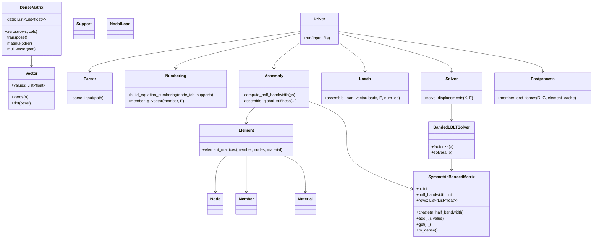

# UML Class Diagram (Textual / Mermaid)

```mermaid
classDiagram
    class Vector {
      +values: List~float~
      +zeros(n)
      +dot(other)
    }

    class DenseMatrix {
      +data: List~List~float~~
      +zeros(rows, cols)
      +transpose()
      +matmul(other)
      +mul_vector(vec)
    }

    class SymmetricBandedMatrix {
      +n: int
      +half_bandwidth: int
      +rows: List~List~float~~
      +create(n, half_bandwidth)
      +add(i, j, value)
      +get(i, j)
      +to_dense()
    }

    class BandedLDLTSolver {
      +factorize(a)
      +solve(a, b)
    }

    class Node
    class Material
    class Member
    class Support
    class NodalLoad

    class Parser {
      +parse_input(path)
    }

    class Numbering {
      +build_equation_numbering(node_ids, supports)
      +member_g_vector(member, E)
    }

    class Element {
      +element_matrices(member, nodes, material)
    }

    class Assembly {
      +compute_half_bandwidth(gs)
      +assemble_global_stiffness(...)
    }

    class Loads {
      +assemble_load_vector(loads, E, num_eq)
    }

    class Solver {
      +solve_displacements(K, F)
    }

    class Postprocess {
      +member_end_forces(D, G, element_cache)
    }

    class Driver {
      +run(input_file)
    }

    BandedLDLTSolver --> SymmetricBandedMatrix
    DenseMatrix --> Vector
    Assembly --> Element
    Assembly --> SymmetricBandedMatrix
    Solver --> BandedLDLTSolver
    Driver --> Parser
    Driver --> Numbering
    Driver --> Assembly
    Driver --> Loads
    Driver --> Solver
    Driver --> Postprocess
    Element --> Node
    Element --> Member
    Element --> Material
```
